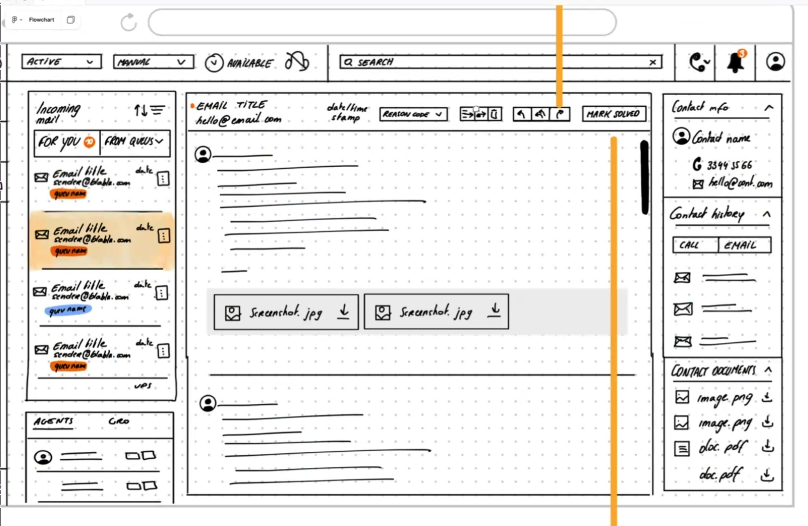

# Senior Frontend Engineer Test

## The setup

We want to put your tech skills to the test as well as learn more about how you think and how you approach an assignment. We are also looking for your cultural fit with the rest of the organization.

We don't find it fair to do excessive tasks as part of our recruitment process, so our expectation is that you use approx. 1 hour for this test.

Email your answers to sox@zylinc.com - text document (assignment 1+3+4) and zip-file (assignment 2).

## The process

1. Initial evaluation and screening of CV matching job-ad expectations (in LinkedIn)
2. If good fit, then candidate is requested to do and submit this test (within 1 week)
3. Evaluation of test feedback by CTO and frontend tech lead
4. If still good fit, then candidate is invited to an onsite interview with CTO and tech lead
5. If still good fit, then interview with CEO and peer frontend engineer
6. Contract signing

## Assignment Preamble

Assume we need to build a new feature for handling emails as part of our product offering. Assume that you get the various various information below made available for you during the start of the project from the product manager and the product designer.

### Feature Name

Email Channel

### Background

Not all end users prefer to call in and instead opt to utilize a text-based medium. We currently cannot offer businesses functionality that allows users to utilize both call and email communication in one unified cloud platform, which means businesses must utilize multiple platforms to support end users on both calls and text.

### Opportunity

As we move to expand our partner network, we find that some partners work primarily with the SMB segment and that those businesses have an inherit need to combine both calls and text support. We believe this will strengthen our position towards diverse types of partners.  

Building an email channel so customers can combine voice and email in one platform puts us on the map as a Contact Center, instead of the Call Center solution we are today.

### Scope

The scope of the Email Communication Service will be limited to that one channel. Things like Instant Messaging, SMS, Chatbots and Virtual Assistants, In-App Messaging and Social Messaging etc. are out of scope for this project. Taking the ticket centric approach is out of scope for this project. Any AI enhancements will also be out of scope for this project. 

We build upon our current call functionality and utilize as much working functionality from that, so we can deliver a working service that doesn’t require us to invent the wheel and is easy to combine with our current voice functionalities at a later stage. 

### Mockup

## Assignment 1 - UI/UX

Based on the introduction to the feature explained:

- List the most important questions to clarify the specification (max. 3)
- Give short constructive feedback to the UX prototype including suggestions for improvements (max. 3)

## Assignment 2 - React

Based on the introduction to the feature explained:

- Outline the React structure and components you would choose to build this UI (TypeScript code is expected, we will not attempt to render the code or look at the UI, just look at your structure and approach in folders/files/classes).
- Shortly discuss your approach to implementing business logic and the ability to changes to the specification as the feature evolves.
- Explain how you would approach testing the functionality.

(If possible, take into consideration our current tech stack use of React, Redux, TypeScript, Material UI, Redux Toolkit, Storybook, lodash, moment.js, SignalR, and Vite)

## Assignment 3

What is your number one resource (e.g. book, blog, website) you keep getting back to and find valuable?